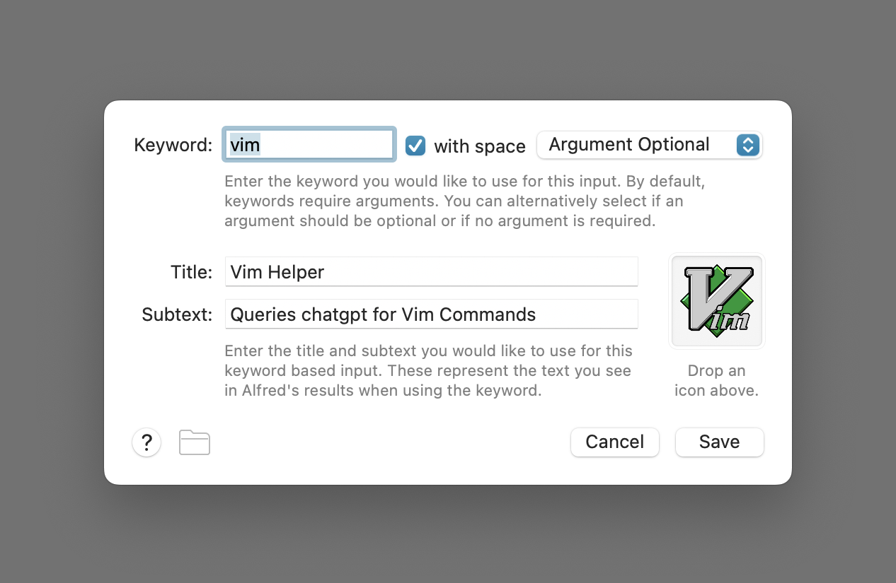
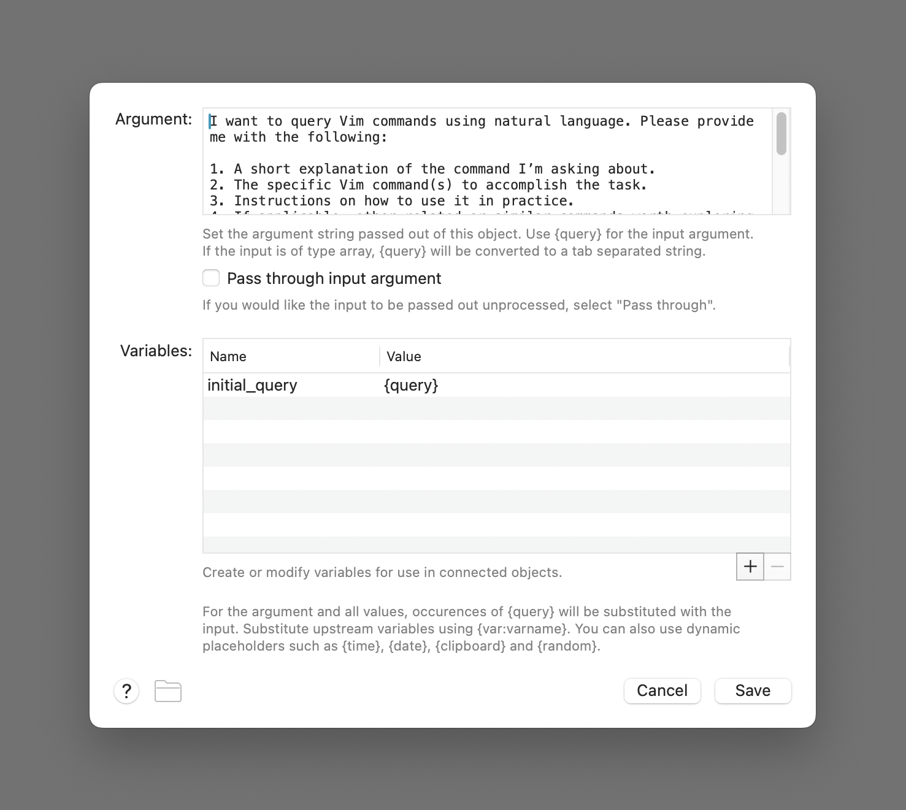
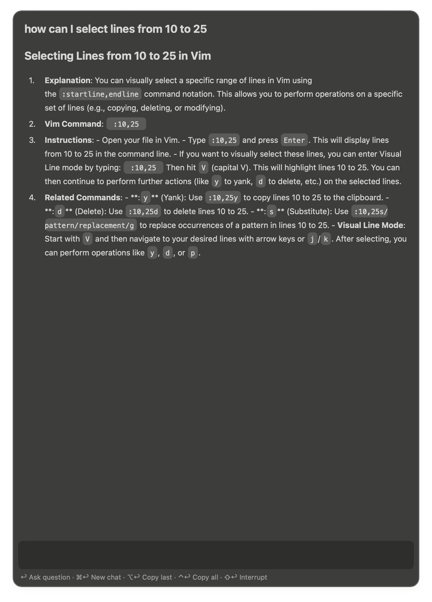

# ChatGPT Alfred Workflow Extender

An extension for the [alfredapp/openai-workflow](https://github.com/alfredapp/openai-workflow) that enhances its functionality by simplifying prompt customization for various use cases. This extender is ideal for users who already have the original workflow set up and want to fine-tune it for multiple tailored use cases.

## Why?

The original workflow enables customization by allowing you to add a System Prompt, which is responsible for tailoring the initial message to guide ChatGPT’s responses based on your expectations. However, this approach applies the same instructions to all your queries. My objective here is to create multiple starting points with tailored triggers and prompts, providing the flexibility to query specific information I need daily—directly through Alfred—while maintaining a more dynamic and personalized experience.

## ⚠️ Prerequisites

This workflow **requires** the original [OpenAI Workflow](https://github.com/alfredapp/openai-workflow) to be set up and working correctly. For setup instructions, please refer to the original repository.

[⤓ Install the original workflow from the Alfred Gallery](https://alfred.app/workflows/alfredapp/openai)

## ✨ Features

- **Custom Inputs**: Add as many custom inputs as you need for your specific use cases.
- **Clutter-Free Editing**: Easily customize prompts with a minimal connector setup to keep it decluttered and easy.
- **Update-Friendly**: Your customizations should remain intact even if the original OpenAI Workflow gets updated, ensuring seamless integration without losing your tailored prompts.

## 🚀 Setup

1. Clone or download this repository.
2. Import the workflow into Alfred.
3. Ensure the original OpenAI Workflow is installed and functioning correctly.
4. Edit the workflow in Alfred to add your custom inputs. Here's an example format:


## 📖 Usage Example: Querying VIM Commands

I often find myself needing to quickly look up VIM commands. The challenge is that sometimes I either don’t know or can’t recall what I need to search for, or I may need to chain multiple commands together. To address this, I’ve created a custom prompt with a tailored trigger that accepts natural language and integrates seamlessly into the original workflow.


### Trigger

In this example, I modified the keyword trigger to use "vim" and added helpful text that will display in Alfred. Additionally, I updated the workflow icon to make it visually distinct and easier to identify at a glance. A screenshot below highlights these changes for reference.



### Custom Input

Here’s the custom initial instruction I use for this workflow:



```text
I want to query Vim commands using natural language. Please provide me with the following:

1. A short explanation of the command I’m asking about.
2. The specific Vim command(s) to accomplish the task.
3. Instructions on how to use it in practice.
4. If applicable, other related or similar commands worth exploring.

Output the response in markdown format for readability.

For example:
- If I ask "How do I delete a line in Vim?", provide a concise explanation, the command (`dd`), steps on how to use it, and suggest related commands like `d` or `D`.
```

Now, I can simply use it with my custom keyword and it is going to apply the initial instruction to all prompts in this workflow.


Here's the output:



---

If you found this workflow extender useful, don’t forget to check out the creators of the original workflow who made this possible. Huge thanks to the Alfred Team ([alfredapp](https://github.com/alfredapp)) and [Vítor Galvão](https://github.com/vitorgalvao) for their incredible work on the original workflow. If you'd like to support my small contribution, feel free to [buy me a coffee](https://buymeacoffee.com/itsmezambo).
